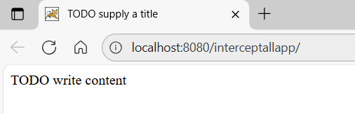
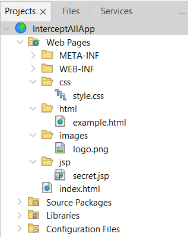
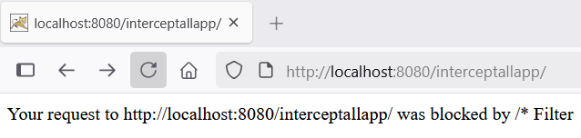
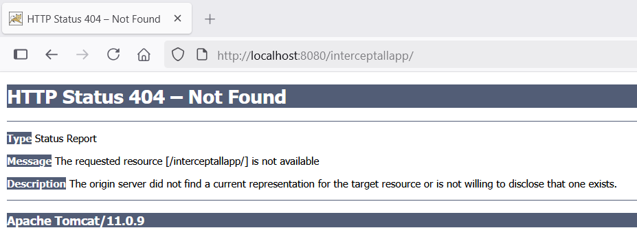
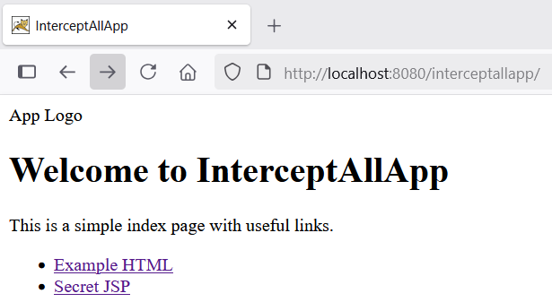
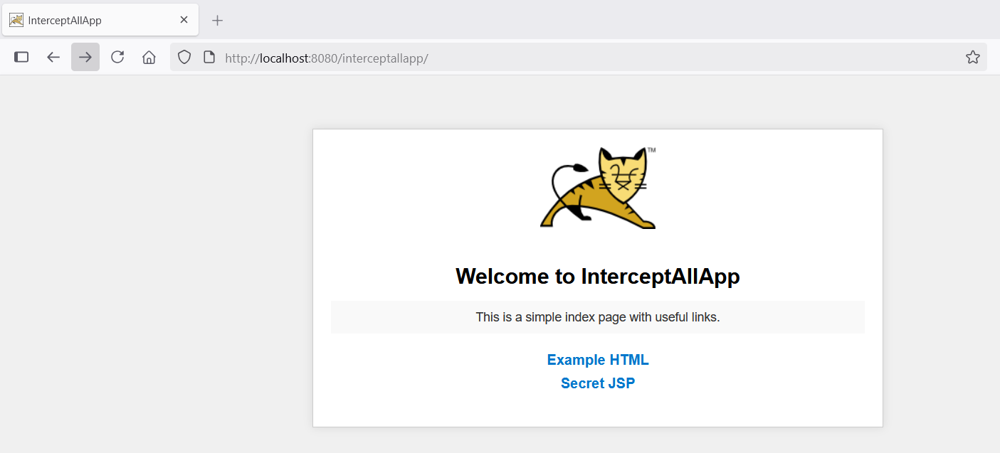
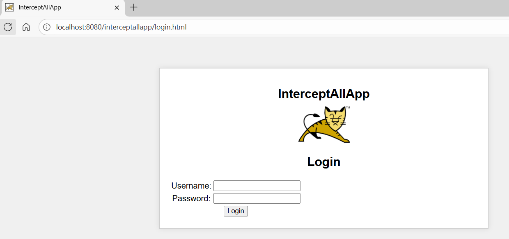

---

### **What Really Happens When You Use a `/*` Filter in Tomcat? A Deep Dive**

---

#### **1. Why Use a Global `/*` Filter in Web Applications?**

Normally, when we build web applications that require authentication and authorization mechanisms to serve resources to users, we often use a filter that intercepts all incoming requests to a web application. Such a filter typically uses the URL pattern ``/*``. Imagine a scenario where your web application serves users with a login form on the default index page. Through this form, we want to enforce authentication before granting access to various resources.

In another scenario, we might want to redirect users to a login page after a session timeout, log all requests to the application, or compress a file before sending it to the client.

In such cases, we prefer a filter over a servlet because of the separation of concerns and centralized control. Servlets are better suited for request handling and content generation, while filters excel at gate-keeping and post-processing. Servlets deal with the core business logic, whereas filters handle cross-cutting concerns such as logging, security, and request or response modification.

Filters can also be chained to process the entire request–response cycle in a modular and layered manner. For all these reasons, filters are a powerful tool in Java web applications—and we often rely on a catch-all filter mapped to the pattern ``/*.``

---

#### **2. The Impact of Mapping a Filter to `/*` on Request Handling**

Let's develop a simple web-app to see how a catch-all filter works. I'm using NetBeans IDE 25. You may use your preferred choice of IDE. I've also downloaded Apache Tomcat version 11.0.9 and unzipped it at ``C:\tomcat1109`` on my PC. 

Using NetBeans I've created a web application project and named it ``InterceptAllApp``. While creating the project I specified the context of the web-app as ``interceptallapp``. Thus, when we run the newly created web-app, it'll be available at ``http://localhost:8080/interceptallapp/``. When we run the web-app we shall see similar output like shown below:



That's the default ``index.html`` being served. So far so good. 

Now, let's create a few resources as shown in the image below:



First, I've created four folders - `css`, `html`, `jsp`, and `images`. 

Then I created the following files:

* `style.css` in the `css` folder
*  `example.html` in the `html` folder
* `secret.jsp` in the `jsp` folder
* `logo.png` in the `images` folder (copied from the Tomcat logo)

The `css, html,` and `images` folders serve static assets. And the `jsp` folder has dynamic files - the JSPs.

Let's now move ahead and create a catch-all filter called  `InterceptAllFilter`. We’ll display a message indicating the request was blocked by the filter.

```java

public class InterceptAllFilter implements Filter {

    public void doFilter(ServletRequest request, ServletResponse response,
            FilterChain chain)
            throws IOException, ServletException {
        HttpServletRequest req = (HttpServletRequest) request;
        HttpServletResponse res = (HttpServletResponse) response;        
        response.setContentType("text/html");
		response.getWriter().println("Your request to "+this.getFullURL(req)+" was blocked by /* Filter");
    }
    
    //A helper method to obtain the requested URL    
    public String getFullURL(HttpServletRequest request) {
        String scheme = request.getScheme();             // http or https
        String serverName = request.getServerName();     // localhost, domain
        int serverPort = request.getServerPort();        // 8080, etc.
        String contextPath = request.getContextPath();   // /app
        String servletPath = request.getServletPath();   // /login.html
        String pathInfo = request.getPathInfo();         // extra path (if any)
        String queryString = request.getQueryString();   // ?lang=en

        StringBuilder url = new StringBuilder();
        url.append(scheme).append("://").append(serverName);

        if ((scheme.equals("http") && serverPort != 80) ||
            (scheme.equals("https") && serverPort != 443)) {
            url.append(":").append(serverPort);
        }

        url.append(contextPath).append(servletPath);

        if (pathInfo != null) {
            url.append(pathInfo);
        }

        if (queryString != null) {
            url.append("?").append(queryString);
        }

        return url.toString();
    }
}
```

The ``web.xml``:
```xml
<filter>
        <filter-name>InterceptAllFilter</filter-name>
        <filter-class>filters.InterceptAllFilter</filter-class>
</filter>
<filter-mapping>
    <filter-name>InterceptAllFilter</filter-name>
    <url-pattern>/*</url-pattern>
</filter-mapping>   
```


The `/*` filter works as expected—it intercepts and blocks all incoming requests, including those for the default `index.html` page, unless explicitly allowed.


Let's allow the default page:
```java
public void doFilter(ServletRequest request, ServletResponse response,
            FilterChain chain)
            throws IOException, ServletException {
        HttpServletRequest req = (HttpServletRequest) request;
        HttpServletResponse res = (HttpServletResponse) response;

        String uri = req.getRequestURI();          // e.g., /webapp/
        String ctx = req.getContextPath();         // e.g., /webapp
        String path = uri.substring(ctx.length()); // e.g., /
        if (path.equals("/")) {
        	System.out.println("Allowing the URL:" + this.getFullURL(req));
            chain.doFilter(request, response);
            return;
        }
        System.out.println("Blocking the URL:" + this.getFullURL(req));
        response.setContentType("text/html");
        response.getWriter().println("Your request to " + this.getFullURL(req) + " was blocked by /* Filter");
}
```


It didn’t work because even though we allowed `/`, Tomcat didn’t automatically map this to `index.html` unless it was explicitly declared in the `welcome-file-list`.



We can make it work by declaring the ``index.html`` as a welcome file in the ``web.xml`` as shown below:
```xml
<filter>
    <filter-name>InterceptAllFilter</filter-name>
    <filter-class>filters.InterceptAllFilter</filter-class>
</filter>
<filter-mapping>
    <filter-name>InterceptAllFilter</filter-name>
    <url-pattern>/*</url-pattern>
</filter-mapping>
<welcome-file-list>
    <welcome-file>index.html</welcome-file>
</welcome-file-list>    
```

This tells Tomcat to serve ``index.html`` when a user visits ``/interceptallapp/``. And it works now:



But, we see that logo and HTML styles are missing.

#### **3. Why Do Images and CSS Sometimes Fail to Load After Adding a `/*` Filter?**

From the Tomcat logs, I see that the filter has allowed ```/index.html``` and blocked everything else:
```java
Allowing the URL: http://localhost:8080/interceptallapp/index.html
Blocking the URL: http://localhost:8080/interceptallapp/css/style.css
Blocking the URL: http://localhost:8080/interceptallapp/images/logo.png
```

Because the filter catches everything `/*, we need to make sure the filter lets static resources like images and stylesheets pass through so that the `DefaultServlet` can serve them. Let's modify the `doFilter()` method:

```java
if (path.equals("/")|| path.endsWith(".png") || path.endsWith(".css")) {
        System.out.println("Allowing the URL:" + this.getFullURL(req));
        chain.doFilter(request, response);
        return;
}
```

And that works, as shown below - ``logo.png`` and ``style.css`` were allowed:



---

Note that the links to ``example.html`` and ``secret.jsp`` still don't work. Why? Let's find out.

So far:
* we began with filtering access to everything under our app - ``/interceptallapp/* ``
* we then allowed the default content through the filter by specifying the path ``/`` in the ``doFilter()`` method, and then specifying the ``index.html`` as a ``welcome-file`` in ``web.xml``
* we then allowed images and stylesheets

Now that we’ve seen the problem, let’s look at who is responsible for serving these static files in Tomcat.

#### **4. Introducing Tomcat’s DefaultServlet: The Static Resource Server**

Straight from the Tomcat docs: *The default servlet is the servlet which serves static resources as well as serves the directory listings (if directory listings are enabled).*

The ``DefaultServlet`` can be found declared in ``C:\tomcat1109\conf\web.xml``. Because I've installed Tomcat at ``C:\tomcat1109``. This servlet is responsible for delivering static resources such as `.html, .css, .js,` and images. It does not handle dynamic content like `.jsp`.
```xml
<servlet>
    <servlet-name>default</servlet-name>
    <servlet-class>
      org.apache.catalina.servlets.DefaultServlet
    </servlet-class>
    <init-param>
        <param-name>debug</param-name>
        <param-value>0</param-value>
    </init-param>
    <init-param>
        <param-name>listings</param-name>
        <param-value>false</param-value>
    </init-param>
    <load-on-startup>1</load-on-startup>
</servlet>

...

<servlet-mapping>
    <servlet-name>default</servlet-name>
    <url-pattern>/</url-pattern>
</servlet-mapping>
```
We can see that the ``DefaultServlet`` is mapped to the URL pattern ``/``. Thus, it served the ``index.html`` because the file was declared as a welcome file. Open the ``web.xml`` shown above and modify the debug parameter value from 0 to 1 or 11. Restart the Tomcat server and open Tomcat's logs (``C:\tomcat1109\logs\localhost.2025-07-31.log``) to see the ``DefaultServlet`` serving static content:

```xml
31-Jul-2025 19:31:40.085 INFO [http-nio-8080-exec-9] org.apache.catalina.core.ApplicationContext.log default: DefaultServlet.serveResource:  Serving resource '/index.html' headers and data
31-Jul-2025 19:31:40.085 INFO [http-nio-8080-exec-9] org.apache.catalina.core.ApplicationContext.log default: DefaultServlet.serveFile:  contentType='text/html'
31-Jul-2025 19:31:40.085 INFO [http-nio-8080-exec-9] org.apache.catalina.core.ApplicationContext.log default: DefaultServlet.serveFile:  contentLength=891
31-Jul-2025 19:31:40.210 INFO [http-nio-8080-exec-1] org.apache.catalina.core.ApplicationContext.log default: DefaultServlet.serveResource:  Serving resource '/css/style.css' headers and data
31-Jul-2025 19:31:40.211 INFO [http-nio-8080-exec-1] org.apache.catalina.core.ApplicationContext.log default: DefaultServlet.serveFile:  contentType='text/css'
31-Jul-2025 19:31:40.211 INFO [http-nio-8080-exec-1] org.apache.catalina.core.ApplicationContext.log default: DefaultServlet.serveFile:  contentLength=973
31-Jul-2025 19:31:40.218 INFO [http-nio-8080-exec-2] org.apache.catalina.core.ApplicationContext.log default: DefaultServlet.serveResource:  Serving resource '/images/logo.png' headers and data
31-Jul-2025 19:31:40.220 INFO [http-nio-8080-exec-2] org.apache.catalina.core.ApplicationContext.log default: DefaultServlet.serveFile:  contentType='image/png'
31-Jul-2025 19:31:40.220 INFO [http-nio-8080-exec-2] org.apache.catalina.core.ApplicationContext.log default: DefaultServlet.serveFile:  contentLength=8410
31-Jul-2025 19:31:40.245 INFO [http-nio-8080-exec-6] org.apache.catalina.core.ApplicationContext.log default: DefaultServlet.serveResource:  Serving resource '/favicon.ico' headers and data
31-Jul-2025 19:31:40.247 INFO [http-nio-8080-exec-6] org.apache.catalina.core.ApplicationContext.log default: DefaultServlet.serveFile:  contentType='image/x-icon'
31-Jul-2025 19:31:40.247 INFO [http-nio-8080-exec-6] org.apache.catalina.core.ApplicationContext.log default: DefaultServlet.serveFile:  contentLength=21630
```

Note that ``DefaultServlet`` serves static content only when the filter passes control using ``chain.doFilter()``.

---

#### **5. How to Let DefaultServlet Serve Static Content Despite a `/*` Filter**

To avoid static content being blocked by the filter, we need to explicitly allow static content to pass through.

* Make sure that the static content exists.
* Add welcome file configuration in `web.xml`
* Update the filter code to allow static resources
```java
String uri = req.getRequestURI();          // e.g., /interceptallapp/index.html
String ctx = req.getContextPath();         // e.g., /interceptallapp
String path = uri.substring(ctx.length()); // e.g., /index.html

if (path.equals("/") ||
    path.equals("/index.html") ||
    path.contains("html/") ||
    path.endsWith(".css") ||
    path.endsWith(".js") ||
    path.endsWith(".png") ||
    path.endsWith(".jpg") ||
    path.endsWith(".ico")) {
    chain.doFilter(request, response); // Let DefaultServlet handle it
    return;
}
```

When a filter calls HttpServletResponse.sendRedirect() or otherwise commits the response without invoking chain.doFilter(), the request processing stops at the filter, so the DefaultServlet never gets a chance to serve static resources.

In our example we wanted the JSP file ``secret.jsp`` remain only accessible after a successful login. So, we redirect the user to ``login.html`` page from the filter:



```java
public void doFilter(ServletRequest request, ServletResponse response,
            FilterChain chain)
            throws IOException, ServletException {
        HttpServletRequest req = (HttpServletRequest) request;
        HttpServletResponse res = (HttpServletResponse) response;
        
        String uri = req.getRequestURI();          // e.g., /webapp/
        String ctx = req.getContextPath();         // e.g., /webapp
        String path = uri.substring(ctx.length()); // e.g., /
        if (path.equals("/")||path.endsWith(".png")||path.endsWith(".css") || path.contains("html/") || path.contains("login.html")) {
            System.out.println("Allowing the URL:" + this.getFullURL(req));
            chain.doFilter(request, response);
            return;
        }
        System.out.println("Blocking the URL:"+this.getFullURL(req));
        if(path.contains("jsp/")) {
            res.sendRedirect("../login.html"); 
            return;
        }
        response.setContentType("text/html");
        response.getWriter().println("Your request to " + this.getFullURL(req) + " was blocked by /* Filter");
    }
```

#### **6. Conclusion**

Using a global /* filter gives you centralized control over all incoming requests. However, it requires careful handling to ensure that static resources are not inadvertently blocked. By understanding how Tomcat’s `DefaultServlet` works and how to configure welcome files and filter logic properly, you can build secure, robust, and user-friendly Java web applications.

---

