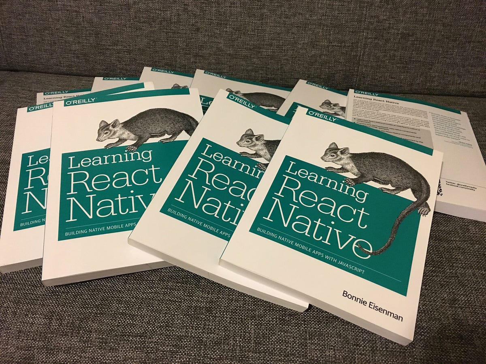

##  Understanding Equality in Java: == vs equals() 

### 1. Introduction

Equality of primitive values is intuitive in Java. But when it comes to the equality of objects, it requires deeper understanding. In this article, I’m going to explain the concept with clear examples.

---

### 2. Two Types of Equality in Java

Let’s first look at the concept of equality between primitive variables. Suppose two integer variables `i` and `j` are assigned the same value:

```java
int i = 8;
int j = 8;

System.out.println(i == j); // prints true
```

Both are considered equal because they hold the same binary representation of the numerical value 8. This holds true for all the other primitive types.

Now, let’s use the same `==` operator to compare objects:

```java
String s1 = new String("abcd");
String s2 = new String("abcd");

System.out.println(s1 == s2); // prints false
```

Although both objects contain the same content `"abcd"`, they are not considered equal. This is because the reference variables `s1` and `s2` refer to two different objects on the heap.

Reference variables in Java do not store the actual object content. Instead, they store the bit pattern that represents the memory address (or reference) *to* the object on the heap. Since `s1` and `s2` refer to different heap locations, their bit patterns differ.

Unlike primitive variables, there is no way in Java to directly view or print the bit pattern of a reference variable.

Now that the equality operator `==` does not make sense for comparing object content, Java provides us with another way to compare two objects for equality — by using the `equals(Object obj)` method from the `Object` class.

Before we discuss the `equals(Object obj)` method, let’s first try to understand what we mean by object equality. Consider the below picture of multiple copies of the same book:

<!---  --->
<p align="center">

</p>

Are all those books equal? Strictly speaking, no — because they are physically separate, individual copies — just like individual Java objects on the heap.

However, those books carry the same content, same title, same ISBN, and are written by the same author. They are *meaningfully* equal. They can be compared based on what’s inside them. If we return a book to a bookstore and later buy the same title again, we receive a different physical copy — but it’s essentially the same book.

We need a similar mechanism in Java to compare objects based on their *meaning*, not their *identity* — and that’s where the `equals(Object o)` method from the `Object` class comes in.

---

### 3. Default Behavior of equals() in Object Class

Every object inherits the `equals(Object obj)` method from the `Object` class. By default, this method compares references:

```java
@Override
public boolean equals(Object obj) {
    return this == obj;
}
```

Let’s look at the following example:

```java
class Book {
    private String isbn;
    private String title;

    Book(String title, String isbn) {
        this.title = title;
        this.isbn = isbn;
    }
}

Book book1 = new Book("Java", "912345678");
Book book2 = new Book("Java", "912345678");

System.out.println(book1.equals(book2)); // prints false
```

Because `book1` and `book2` refer to different objects on the heap, the default implementation of the `equals(Object obj)` method will return false. To achieve logical or meaningful comparison of `Book` objects, we must override the method.

---

### 4. Overriding equals() Properly

As programmers, we can define our own criteria for object equality by overriding the `equals()` method. It’s up to us to decide: should two `Book` objects be considered equal if their titles and ISBNs are the same, or is the ISBN alone sufficient?

Let’s modify our `Book` example:

```java
class Book {
    private String isbn;
    private String title;

    Book(String title, String isbn) {
        this.title = title;
        this.isbn = isbn;
    }

    public String getIsbn() {
        return isbn;
    }

    public String getTitle() {
        return title;
    }

    @Override
    public boolean equals(Object o) {
        if (this == o) return true;
        if (!(o instanceof Book)) return false;
        Book otherBook = (Book) o;
        return this.isbn.equals(otherBook.getIsbn()) &&
               this.title.equals(otherBook.getTitle());
    }
}
```

```java
Book book1 = new Book("Java", "912345678");
Book book2 = new Book("Java", "912345678");

System.out.println(book1.equals(book2)); // prints true
```

Because we have defined equality based on the `isbn` and `title` properties, the objects referred to by `book1` and `book2` are now considered equal since both properties carry the same values. Without the override, the result would have been false.

---

### 5. Equality Contract

For a robust `equals()` implementation, Java defines a contract that must be followed when overriding the `Object` class’s `equals()` method. Consider `a` and `b` as variables referring to two objects on the heap:

* **Reflexive:** `a.equals(a)` must be true.
* **Symmetric:** If `a.equals(b)` results in true, then `b.equals(a)` must result in true as well.
* **Transitive:** If `a.equals(b)` and `b.equals(c)`, then `a.equals(c)`.
* **Consistent:** Multiple invocations of the `equals(Object obj)` method should give the same result if nothing changes.
* **Non-nullity:** `a.equals(null)` must return false.

---

### 6. Conclusion

As a Java programmer, it is important for us to understand the concept of equality of both primitive variables and objects.

* Use `==` to compare **object identity**. Are the reference variables referring to the same object? This checks whether both references point to the same memory location.
* Use `equals(Object obj)` to compare **object content**. Are the objects being compared meaningfully equal?
* To specify our own criteria for object equality, override the `equals(Object obj)` method.
* The `equals()` contract must always be followed to avoid bugs.

But things get even more interesting when equality comes into play inside collections like `Map, List,` or `Set` — a topic worth exploring next.

---
